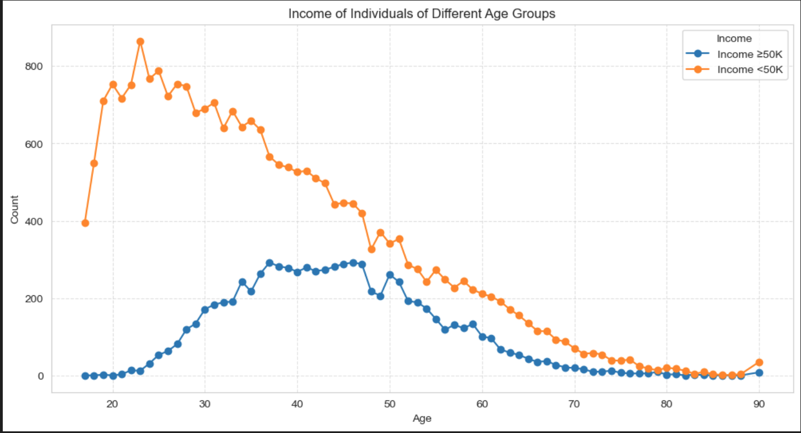
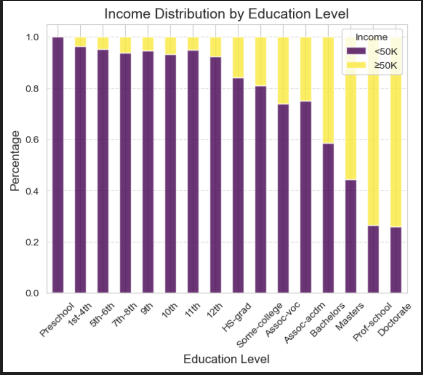
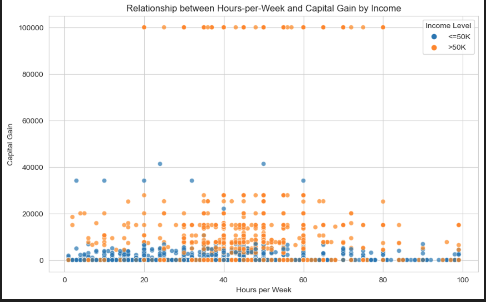
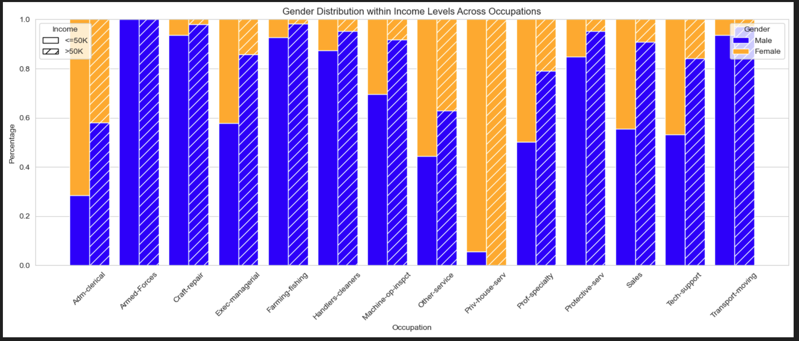
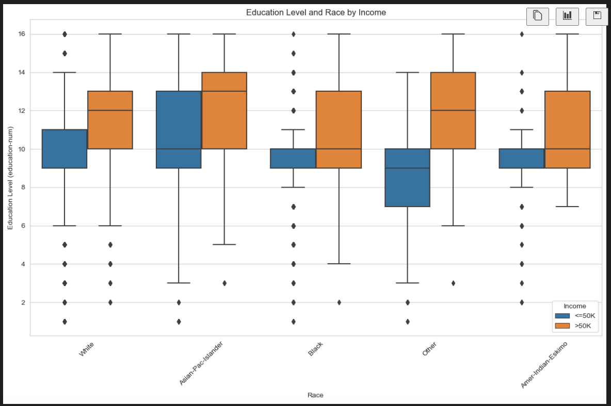

# Executive Summary

This report presents key insights derived from the UCI Adult Income dataset to support targeted enrollment and marketing strategies for a hypothetical college.

The analysis focuses on identifying demographic and socioeconomic patterns associated with income levels, with the goal of informing outreach strategies for individuals who may benefit from further education.

---

## 1. Age and Income Trends

Income distribution shows a clear relationship with age:

- Individuals earning >50K are concentrated between ages 30–55
- Lower-income individuals (<50K) dominate younger age groups (below 30)
- After age 60, both income groups decline significantly

**Insight:**  
Mid-career individuals represent the most promising target segment for upskilling and degree programs.

---

## 2. Education Level and Income

Education level is one of the strongest predictors of income:

- Individuals with Bachelor's degree or higher have a significantly higher proportion of >50K income
- Lower education levels are overwhelmingly associated with <50K income
- The transition point appears around "Some-college" to "Bachelors"

**Insight:**  
Education-driven marketing is highly effective — targeting individuals with incomplete higher education can yield strong conversion potential.

---

## 3. Work Hours vs Capital Gain

The relationship between work hours and income is weak on its own:

- High-income individuals (>50K) are not strictly those working more hours
- Capital gain is a stronger differentiator for higher income groups
- Many low-income individuals work similar hours but lack capital-based income

**Insight:**  
Income disparity is not purely effort-based; financial literacy and investment-related education may be valuable positioning angles.

---

## 4. Gender and Occupation Distribution

Significant variation exists across occupations:

- Certain occupations (e.g., Exec-managerial, Prof-specialty) have higher high-income representation
- Gender imbalance is visible across multiple occupations
- Some roles show strong dominance of one gender group

**Insight:**  
Targeted messaging can be tailored by occupation and demographic composition, particularly in professional and managerial fields.

---

## 5. Education and Race Distribution

Education levels vary across racial groups:

- Higher-income groups consistently show higher median education levels
- Distribution spreads differ across demographic groups
- Education remains a dominant factor regardless of race

**Insight:**  
While demographic differences exist, education level remains the most consistent lever for income mobility.

---

## Key Takeaways

- Education level is the strongest predictor of income
- Mid-career individuals (30–55) are prime targets for enrollment
- Capital-related income differentiates high earners more than working hours
- Occupation and demographic segmentation can improve targeting precision

---

## Marketing Recommendations

Based on the analysis:

- Target individuals earning <50K with career advancement messaging
- Focus on individuals with "Some college" or incomplete degrees
- Promote flexible learning formats (online, part-time)
- Tailor campaigns by occupation clusters (e.g., service vs professional roles)
- Incorporate financial and career growth narratives into messaging

---

## Conclusion

This analysis demonstrates how publicly available demographic data can be transformed into actionable insights for marketing and enrollment strategy.

By focusing on education level, career stage, and occupation segments, institutions can more effectively identify and engage high-potential audiences.
